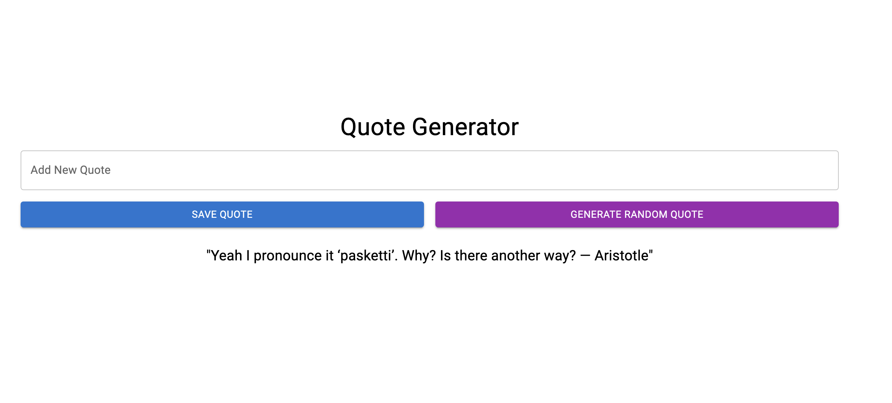

# Quote Generator


A robust full-stack application tailored for quote enthusiasts. Users can effortlessly save their favorite quotes and retrieve random ones at their leisure. Crafted with a modern React frontend, powered by a Python microservice, and backed by SQLite.



## Table of Contents
- [Live Demo](#live-demo)
- [Features](#features)
- [Technologies Used](#technologies-used)
- [Installation & Setup](#installation--setup) 
- [Contributing](#contributing)
- [License](#license)

## Live Demo
* [View Repository](https://github.com/TurboTeam335/quote-generator)
* [Launch Application](https://6513747a847336316b8e4aa9--relaxed-biscuit-401065.netlify.app/)

## Features

* Save Quotes: Never let a good quote fade away. Store them safely and securely.
*  Random Quotes: Need inspiration? Generate a random quote with a simple click.

## Technologies Used

The following technologies are used in this project:

* React
* Material UI
* Python
* Flask
* SQLAlchemy
* SQLite


## Installation & Setup

### Frontend

Install Dependencies:
`````npm install`````

Run the Application:
`````npm start`````

The application should open in your default browser at http://localhost:3000.

### Backend Microservice

Install Dependencies:
`````pip install -r requirements.txt`````

Run the Microservice:
`````python app.py`````

Access the microservice at http://localhost:4000.


## Contributing

Eager to improve or add new features? We'd love your help!

Fork the repository.
Implement your changes.
Submit a pull request.
All contributions are greatly appreciated!

## License

The app is licensed under the MIT license.